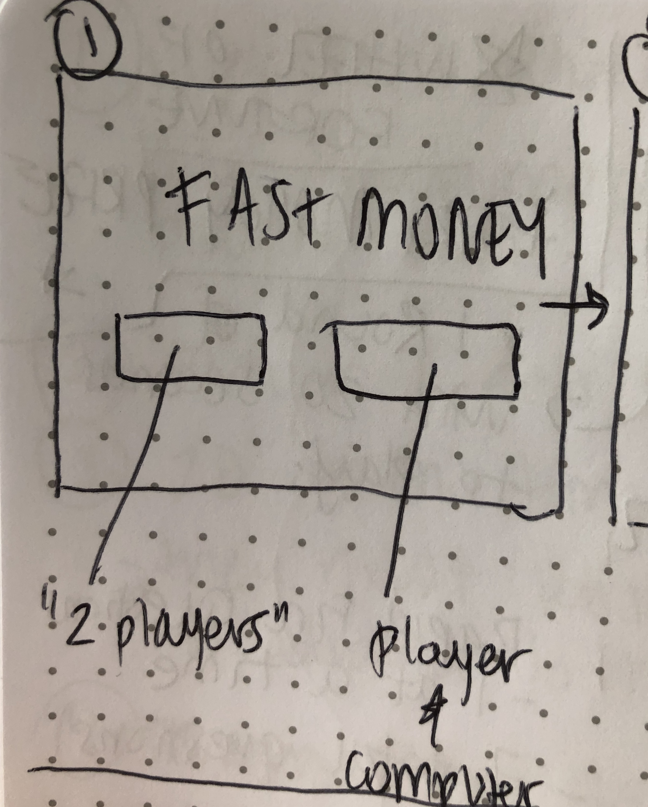
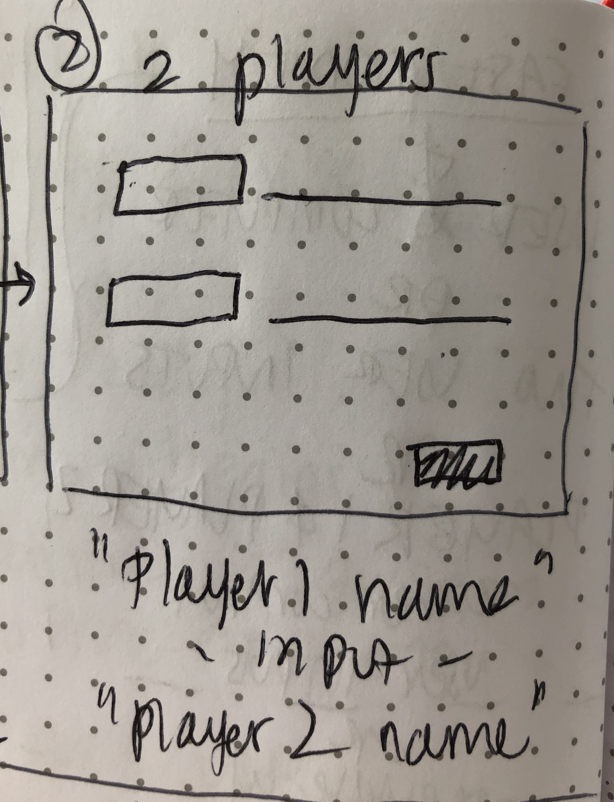
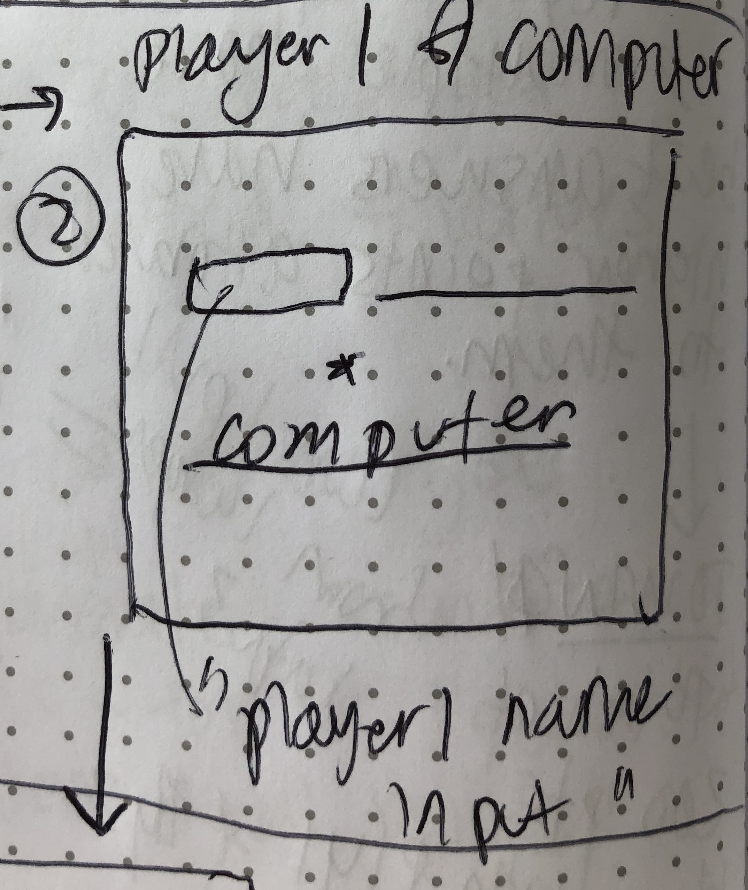
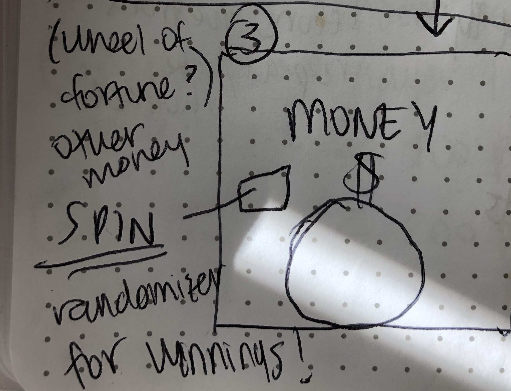
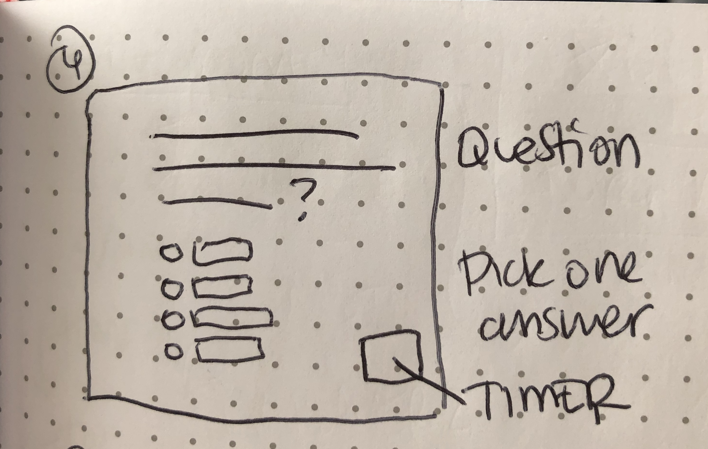
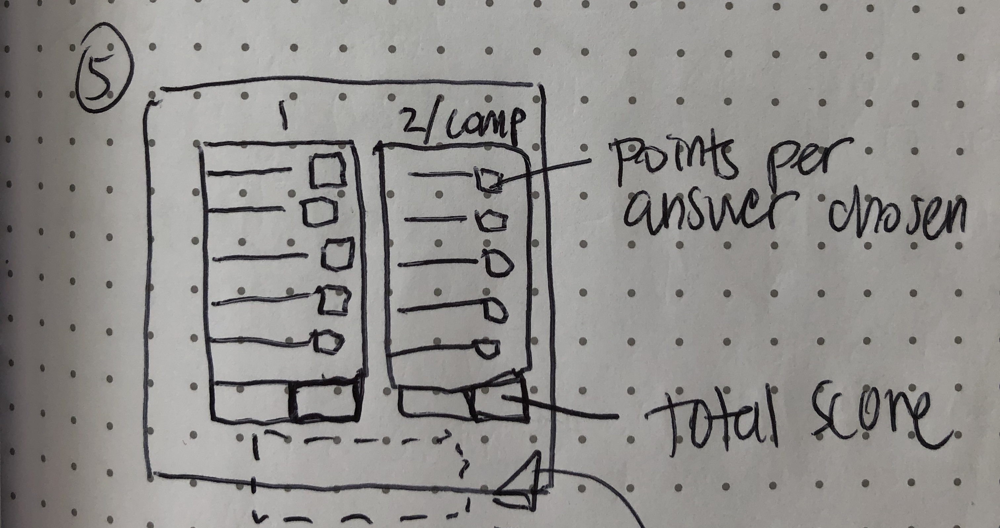
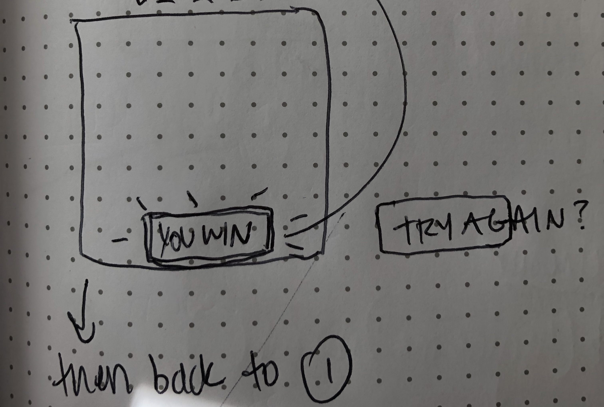

# Project-0
Fast Money!

The Goal: 
The goal of the game Fast Money is to get a combined score of at least 200pts or over between both player1 and player2. Each answer is associated with higher or lower points. Higher points are set to answers that are most likely to be answered by the majority of a pool of people. If player1 and player2 cannot get a cumulative score of at least 200 points, they lose and don't go home with any winnings. 

How to Play:
1. User clicks button to Select Two Player Mode.
2. User is promted to get Player1Ready. Select what you think is the PUBLIC'S MOST POPULAR answer, then hit NEXT in order to move to the next question. 
3. At the end of Player1's round, It will congratualate and display their total score. And prompt Player2 to get ready for their turn.
4. Player 2, will be prompted to get ready, this user will get the same round of questions as Player1.
5. User must choose what they think is the most popular answer.  
6. Once Player2 round ends- the score will be tallied up based on the points attributed to each 'best most popular trivia answer.' 
7. Reach 200 points combined in order to win cash money prize! 
8. Anything below 200 points, and users lose. No money."
9. User is then prompted to Start Over if they'd like.

Ideas/Functionality in Game Expansion:
1. Begin game with a spinning wheel of potential "prize money" to win.
2. Create a 20 second timer feature to go with each player round. 
3. Enhance the CSS to match the wireframes. 
4. Create a larger data pool of questions, or use an API for questions/answers/points
5. Create a Randomizer and shuffler fuction to give the user more chances to play multiple times with different questions
6. Set each answer to more specific points to create a more difficult chance of winning. 

Original Wireframes:

 
 
 
 
 

 
